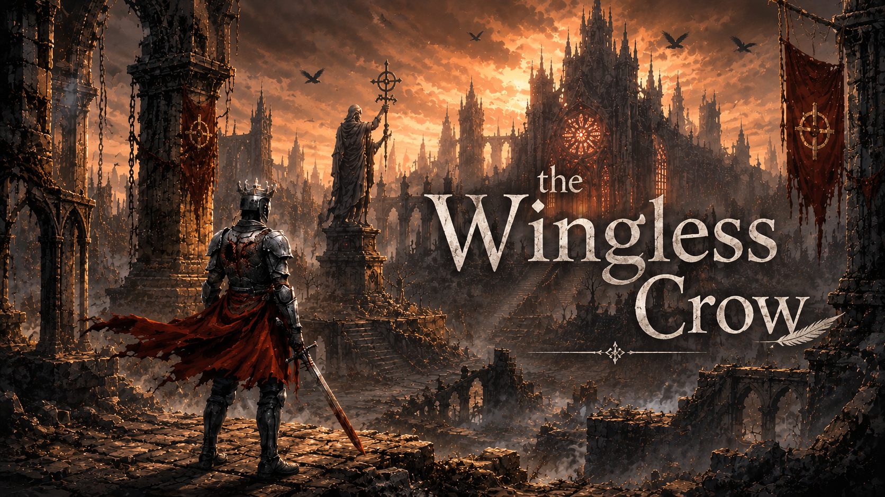
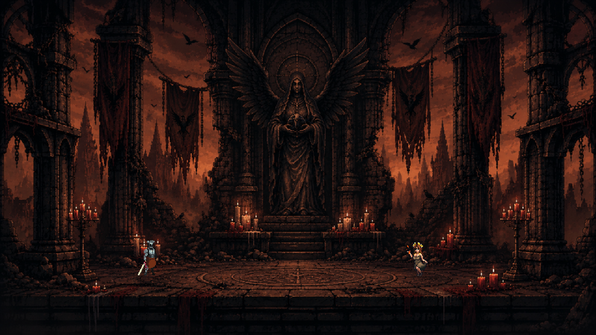
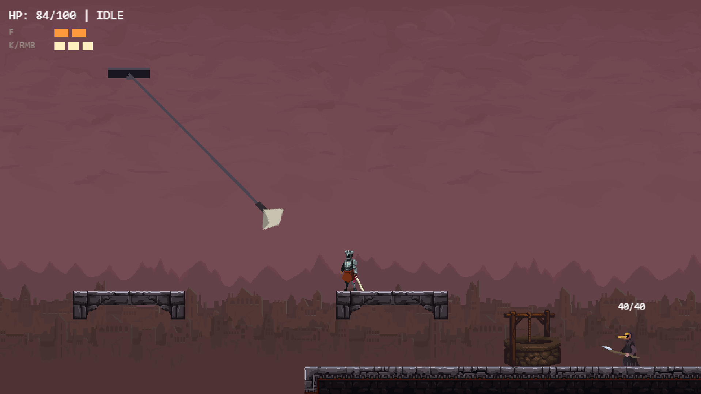
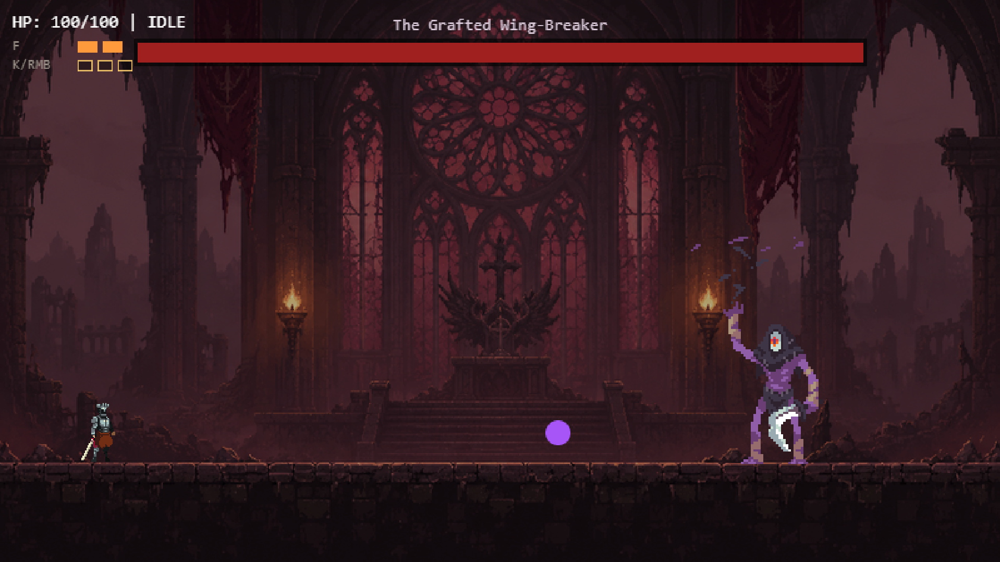
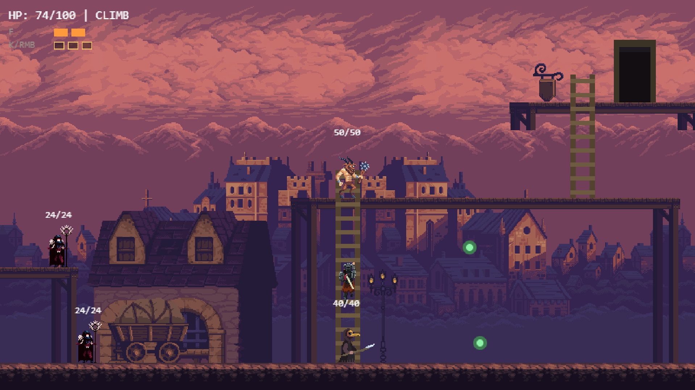

# The Wingless Crow



A short dark fantasy action platformer that runs in the browser: three levels, four
bosses, about twenty minutes from the fall to the credits.

It is a hobby project but also serves as a QA engineering portfolio piece. I built the game with an AI-assisted workflow and
ran its development like a product release, with a risk-based test strategy, automated tests at
the right levels, manual validation and CI quality gates.

[play-itch]: https://bioengineerlabs.itch.io/the-wingless-crow
[play-pages]: https://csokanandor95.github.io/the-wingless-crow/

[](https://github.com/csokanandor95/the-wingless-crow/actions/workflows/ci.yml)

**▶ Play in the browser: [itch.io][play-itch] · [GitHub Pages][play-pages]**
No install, no account — it runs in a desktop browser. You can also
[run it locally](#run-locally) with two commands.

## Screenshots

| | |
|---|---|
|  |  |
| **The opening shrine.** Lazar wakes up without his wings. | **Level 1.** A swinging reaper guards the only bridge. |
|  |  |
| **The Grafted Wing-Breaker.** Two phases, readable telegraphs. | **Level 2.** A Beast on the scaffold, Gravecallers below. |

## About the game

Lazar, the Crowmarked, guards the gate between the living and the dead, and his crows are his
eyes. A mad king makes a pact with an ancient demon to bring his dying queen back. The demon keeps
its word, then cages the crows, and the order between the two worlds breaks. Lazar survives but
loses his wings, and sets out to put things right.

- **About 20 minutes**, played in one sitting, single player, fully offline
- **3 levels:** a ruined cathedral approach, a gothic town quarter and a beast dungeon
- **4 bosses**, each with its own kind of pressure: reach, pure melee, a charging mini-boss and
  area denial
- **3 enemy types:** a melee harvester, a ranged caster and a charger
- **Combat:** sword, a heavy slash charged by landed hits, and a fireball with two charges
- **Presentation:** pixel art, 9 music tracks, sound effects for combat and movement, and boss
  dialogue
- Desktop browser game with keyboard and mouse controls, no install

**Controls:** `A`/`D` or arrows to move · `Space`/`W` jump · `E` interact · `J` or LMB sword ·
`K` or RMB heavy slash · `F` fireball · `F11` fullscreen. The main menu has a full controls page.

## Why this project is interesting

Plenty of hobby games get made with AI. What I wanted to find out was what happens when a small
but real game goes through a proper quality process from start to finish. The question behind the
whole test effort was simple: *can I confidently publish this?* The answer had to hold without
turning a 20-minute game into an over-engineered test project.

In practice, that meant:

- **Risk-based testing:** a risk map drove what got tested and at which level, and anything that
  didn't trace back to a risk wasn't written
- **A written test strategy** covering test levels, release criteria and what stays out of scope
- **Automation at the right layers:** logic in unit tests, module contracts in integration tests,
  scenes and progression in a real browser
- **Manual validation:** full playthroughs, exploratory charters and feedback from beta players
- **Regression coverage:** bugs and balance problems found by hand became automated checks
- **CI quality gates and a manual release gate** before anything ships

## My role

This is a solo portfolio project built with AI assistance. The AI helped with implementation. I
was responsible for what got built, how it was verified and whether it was good enough to accept.

- Defined the scope, requirements and roadmap, and kept scope creep out
- Set the game and product direction: levels, bosses, atmosphere, asset selection and the
  licensing review
- Owned the QA strategy: risk analysis, test levels, test scope and release criteria
- Did the manual testing: playthroughs, exploratory sessions and triage of beta feedback
- Investigated bugs and edge cases, and turned important findings into regression checks
- Defined the CI quality gates and the release validation checklist
- Reviewed AI-generated code and tests, and made the final engineering and QA decisions
- Maintained the project documentation

## Quality Engineering

The project uses a layered, risk-based QA approach rather than relying on a single test type.

| Layer | What it covers | Scale | When |
|---|---|---|---|
| **Unit** | Game logic, state machines, level geometry, balance rules | 967 tests | every push |
| **Integration** | Real modules working together: combat, checkpoint → respawn | 23 tests | every push |
| **E2E (Playwright)** | Every scene starts, door routing and progression, asset integrity, no console errors | 18 tests, Chromium | every push |
| **Cross-browser** | Startup smoke test | 5 tests, Firefox | every push |
| **Build sanity** | The production build works from a sub-path (itch.io) | 2 assertions | every push |
| **Performance** | Load time, frame time | 2 metrics | on demand |
| **Manual / exploratory** | Full playthrough checklist, audio, feel, Safari | 8-point checklist + 5 charters | before release |
| **Beta** | Real players on a private itch.io draft | — | before release |

That comes to **1,015 automated tests** running in GitHub Actions behind six quality gates:
unit, integration, build, deploy sanity, E2E and zero critical errors. The E2E fixture fails a
test on any console error, uncaught exception or failed request. I checked each new test layer
with fault injection: I put realistic defects back in, including two bugs the project really had,
and confirmed that the tests went red.

For the full test strategy, risk map and coverage details, see
**[Test-plan.md](docs/Test-plan.md)**.

## QA case study: a boss that felt unfair

**Observation.** In manual playtesting, the second boss, the Mad King, felt too hard and unfair.
His sword slash came so fast that there was no real chance to react to it.

**Investigation.** "Too hard" isn't something you can act on, so I measured it. I took the
player's own movement values (jump speed, run speed, gravity) and calculated how far the player
can get during the attack's wind-up. At 330 ms, a jump alone couldn't reach safe distance. Only a
jump combined with a step back worked, and it had to happen almost instantly.

**Fix.** I doubled the wind-up to 660 ms, which is enough for a jump alone to clear the attack.
Going higher wouldn't help, because a standing jump gains no extra distance past its apex. I
retuned the damage and recovery windows along with it.

**Regression check.** The fairness rules are now unit-test invariants, calculated from the
player's constants. If someone later tries to "speed the boss up", the change fails in CI instead
of turning up in the next playthrough. The full measurements are in the
[devlog](docs/devlog.md) (*Fairness-hangolások*).

Measurement also led me to throw a test layer away. A classic pixel-diff visual regression gate
failed its own validation: it flaked on unchanged builds (roughly 1 run in 4–5), and it missed a
decor prop moved by 20 px. I replaced it with screenshots attached to the report for
human review, plus two reliable automated checks: the canvas is not blank, and all assets load.

## Selected engineering decisions

- **Gameplay logic is testable without a browser.** Level layouts, menu geometry and dialogue
  live in engine-free data modules. Players, enemies and bosses run against a lightweight fake of
  the engine, so their state machines and balance rules are unit-tested in seconds.
- **Deterministic gameplay.** Boss attack patterns, hazards and enemy AI have no randomness. That
  makes them learnable for players and gives tests stable, non-flaky assertions.
- **Entities emit events, scenes handle side effects.** Enemies and bosses don't spawn
  projectiles or play sounds themselves. The scene does that, which keeps modules loosely coupled
  and every event observable in a test.
- **Tuning values are derived, not guessed.** Hitboxes, wind-ups and ranges are calculated from
  animation frames and player constants, and tests guard the important ones.

## Architecture

```text
Browser game (Phaser 4)
  Scenes             levels, arenas, menus: wiring, rendering, input   → E2E in a real browser
  Entities & systems player, enemies, bosses, audio, checkpoints       → unit + integration
  Data modules       level layouts, geometry, dialogue, menu layout    → unit (fast, no browser)

GitHub Actions: typecheck → unit → integration → build → deploy sanity → E2E
```

The split follows how the game can be tested. The scene layer is about 30% of the source and can
only be verified meaningfully in a real browser. It's also where every defect found in manual
play turned up. The logic underneath it is covered by fast unit and integration tests.

## Tech stack

Phaser 4 (Arcade Physics) · TypeScript (strict) · Vite · Vitest · Playwright (Chromium, Firefox)
· GitHub Actions · Node.js 24

## AI-assisted development

Most of the implementation was done with AI assistance: a chat-based phase at the start, then
Claude Code. I used it for code implementation, test generation, refactoring and documentation,
in short cycles. I set a small goal, the AI implemented it, and I ran the game, tested it by hand,
fixed what was wrong and added automated tests before moving on. The conventions and the current
state of the system are recorded in [`CLAUDE.md`](CLAUDE.md), so every session started from the
same ground truth.

The process remained human-directed: scope, requirements, architecture decisions, QA strategy,
review, manual validation and final acceptance were owned by me. I also tried a different working
style on Level 3. Levels 1 and 2 had written specs with acceptance criteria, but for Level 3 I
chose the assets and described the scene I had in mind without a formal spec.

## Testing scope & limitations

Knowing what not to test mattered as much as the tests themselves.

- **Boss fights are not automated end to end.** Beating a boss with synthetic keystrokes is
  timing-dependent and flaky, and unit suites already cover phase transitions. Human playthroughs
  cover the fights.
- **No coverage-percentage gate.** It rewards writing more tests, not reducing risk.
- **No pixel-diff visual gate.** It proved unreliable (see the case study), so subtle visual
  drift is caught by human review.
- **WebKit is not in CI.** Playwright's WebKit build has no Web Audio API, so the game can't
  boot there. That is a limitation of the test browser, not a Safari problem. Real Safari is
  checked by hand.
- **Mobile, accessibility, load and security testing are out of scope.** There is no touch
  input, no DOM UI, no backend and no user data.
- **Performance numbers are local.** The 23.5 MB preload, 87% of it audio, is a known item for
  real-world connections.

Details and rationale: [Test-plan.md §3 and §10](docs/Test-plan.md).

## Documentation

- **[`docs/Test-plan.md`](docs/Test-plan.md):** QA strategy, risk map, coverage, CI, findings
  and limitations
- **[`CLAUDE.md`](CLAUDE.md):** the current state of every system, engineering conventions,
  technical lessons and the AI-assisted workflow
- **[`docs/Project_plan.md`](docs/Project_plan.md):** original scope, requirements, roadmap and
  deviations from the plan
- **[`docs/devlog.md`](docs/devlog.md):** development history, discarded alternatives and the
  measurements behind tuned values

The `docs/` folder also contains level specs with acceptance criteria
([Level 1](docs/level1-layout.md), [Level 2](docs/level2-layout.md)) and the
[story premise](docs/story.md). `Test-plan.md` is in English. The other documents are in
Hungarian, the working language of the project.

## Run locally

Requires **Node.js 24+**.

```bash
git clone https://github.com/csokanandor95/the-wingless-crow.git
cd the-wingless-crow
npm ci
npm run dev          # http://localhost:5173

npm run test         # unit tests
npm run build        # production build
```

The full command list, including integration, E2E and the local equivalent of the CI pipeline,
is in [Test-plan.md §8](docs/Test-plan.md).

## Project status

**Complete, playable from start to credits, and released.** The QA phase is closed, and the
game is public on two channels: **[itch.io][play-itch]** (the primary one, uploaded by hand)
and **[GitHub Pages][play-pages]**, deployed automatically by CI — the `deploy-pages` job runs
on `main` pushes only, behind all six quality gates, so nothing reaches the public URL that
has not passed them. Before that, the game was played by beta testers on a private itch.io
draft.

## Credits

Third-party art, music and sound effects are credited in-game. The `CREDITS` list in
[`src/scenes/CreditsScene.ts`](src/scenes/CreditsScene.ts) is the authoritative attribution. Before the repository went public, every
asset package went through a licensing review, recorded in the [devlog](docs/devlog.md)
(*Licenc-átnézés és lezárás*).

## License

© 2026 Nándor Csóka. All rights reserved.

This repository is publicly available for portfolio, educational and reference purposes. The
source code, lore, level design and narrative content and other original project materials may
not be copied, redistributed, relicensed, modified and redistributed, or used in another project
without explicit permission from the author.

Public visibility of this repository does not grant permission to use, reproduce, distribute, or
create derivative works from the project.

Third-party assets included in this repository are subject to their respective licenses. See the
relevant asset directories and license files for details.
